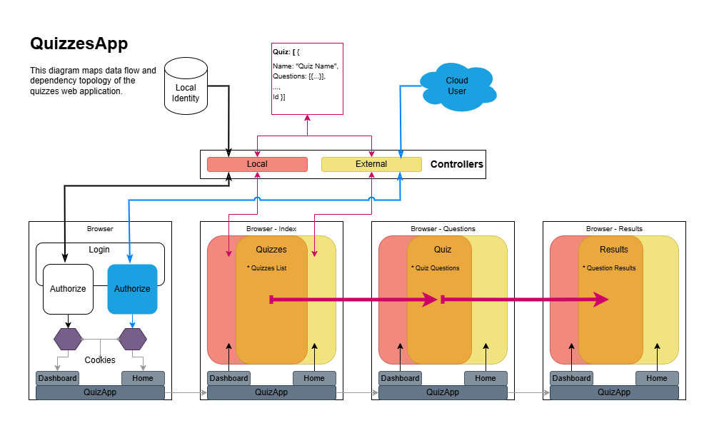

<!-- 
Copyright (c) 2024-2026 Robert A. Howell
Author: Robert A. Howell
Description: A demonstration web application where users choose and take an online quiz.
Created_Date: November 2024
Created: 2026-03-25
Eited: 2026-5-20
-->

# Quizzes App  
A demo web application where users take an online quiz and see computed results.  
Restrictions: You may not use this code in commercial applications, production environments, or for unauthorized purposes without explicit permission from the author.  

Hyperlink: [https://quizzes-demo.rhdeveloping.com/](https://quizzes-demo.rhdeveloping.com/)  
Repo: [QuizzesApp/README.md at master · robhowe-A/QuizzesApp · GitHub](https://github.com/robhowe-A/QuizzesApp/blob/master/README.md?plain=1)  

## Topology Map  

### Dependencies  
Language: C#  
Secondary Languages: .NET 10, SQL  
* Blazor
* Razor pages
* Razor components
* .NET Core Identity
* Google auth
* ASP.NET Core Entity Framework
* Azure blob storage
* Postmark client email

### Additional 
* Source code upgraded from .NET 8
* Email provider moved away from SendGrid
